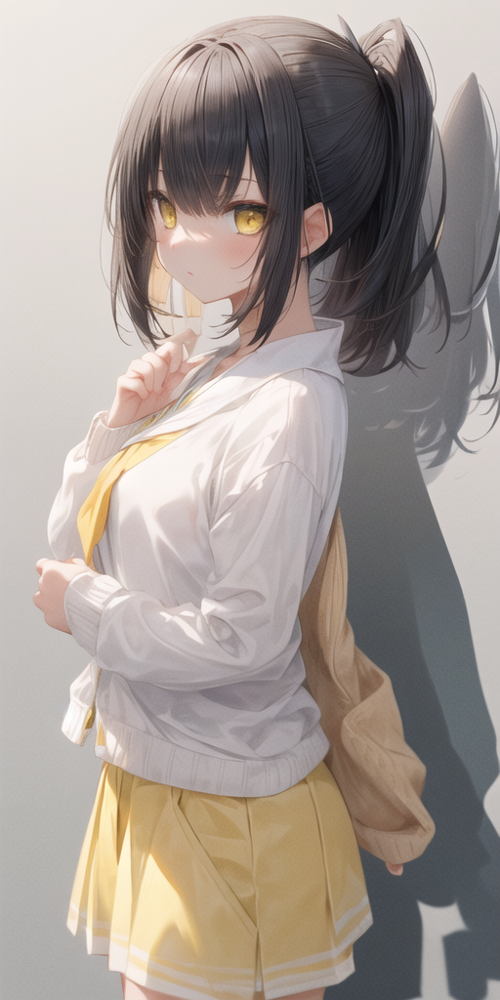
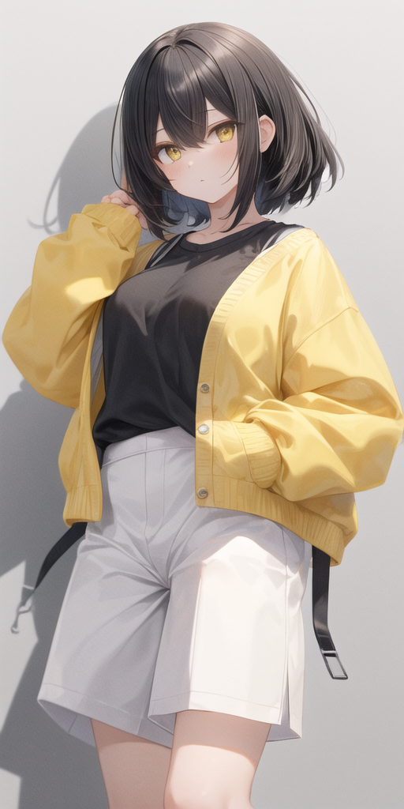

# Asterisk-Ajisai




## 概要
**Asterisk＊Ajisai**は、2Dイラストに強みを持つKawaii系モデルに、3D系モデルと背景表現が得意なモデルをマージして作成された画像生成モデルです。全体的な画質向上を目指し、幅広いスタイルでの高品質な画像生成が可能です。特に、プロンプトにシャドウ（影）を加えることで、よりリアルで奥行きのある表現が得られます。

## 特徴
- **2Dイラスト**のKawaiiスタイルが得意
- **3D表現**に強みがあり、幅広いシーンに対応
- プロンプトに**シャドウ（影）**を含めることで、深みのある画像が生成されやすい

## インストール方法
Hugging Face上でStable Diffusionのカスタムモデルを使用するため、以下のパッケージが必要です。

```bash
pip install transformers
pip install diffusers
pip install accelerate
```

## モデル情報
 - ベースモデル: milktea（Stable Diffusionベース）
 - マージモデル: Kawaii系2Dモデルを中心に、3Dモデルに優れたモデルをマージして画質を向上
 - 推奨設定: プロンプトに「シャドウ」や「影」を追加することで、より良い結果が得られます

## ライセンス
このモデルは、**creativeml-openrail-mライセンス**のもとで公開されています。利用者はライセンスに準拠した利用をお願いします。

---

## Overview
**Asterisk＊Ajisai** is an image generation model created by merging a 2D-focused Kawaii-style model with 3D and background-specialized models. This model aims to enhance overall image quality, producing high-quality images across various styles. Adding shadows to prompts is recommended for achieving more realistic and depth-filled results.

## Features
- Excels at **2D illustrations** in the Kawaii style
- Strong **3D rendering** capabilities, suitable for diverse scenes
- Including **shadow elements** in prompts enhances depth and visual richness

## Installation
To use this custom Stable Diffusion model on Hugging Face, please install the following packages:

```bash
pip install transformers
pip install diffusers
pip install accelerate
```

## Model Details
 - Base Model: milktea (Stable Diffusion-based)
 - Merged Model: Combines a 2D Kawaii-style model with 3D focused models to improve image quality
 - Recommended Setting: Adding "shadow" or "shading" in prompts for optimal results

## License
This model is released under the **creativeml-openrail-m license**. Users are advised to adhere to the terms and conditions specified by this license.
